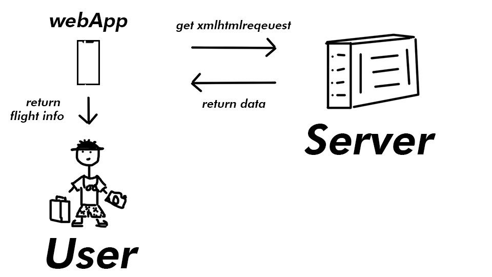

# Real Flight Info

Get your flight information from the most transparent and reliable source!
Its all you need!

Link: https://stijn-aa.github.io/

# Function

See the current flight taking off

# Actor Diagram

# API
[-]	Schiphol Flight API

https://developer.schiphol.nl/

limited to 20 flights per get request, can be modified.

# Interaction

# Best practices
[-] Used XMLHttpRequest; to get the flight information from the api.

[-] Using Get date I modified the request header to get the flight that are currently taking off.

[-] Using forEach I created a block for each departing flight.

# Feature Wishlist

## [📇] Clickable blocks to get more info about the flight status
## [💉] Nice UI

## [🎰] Free ticket generator!
