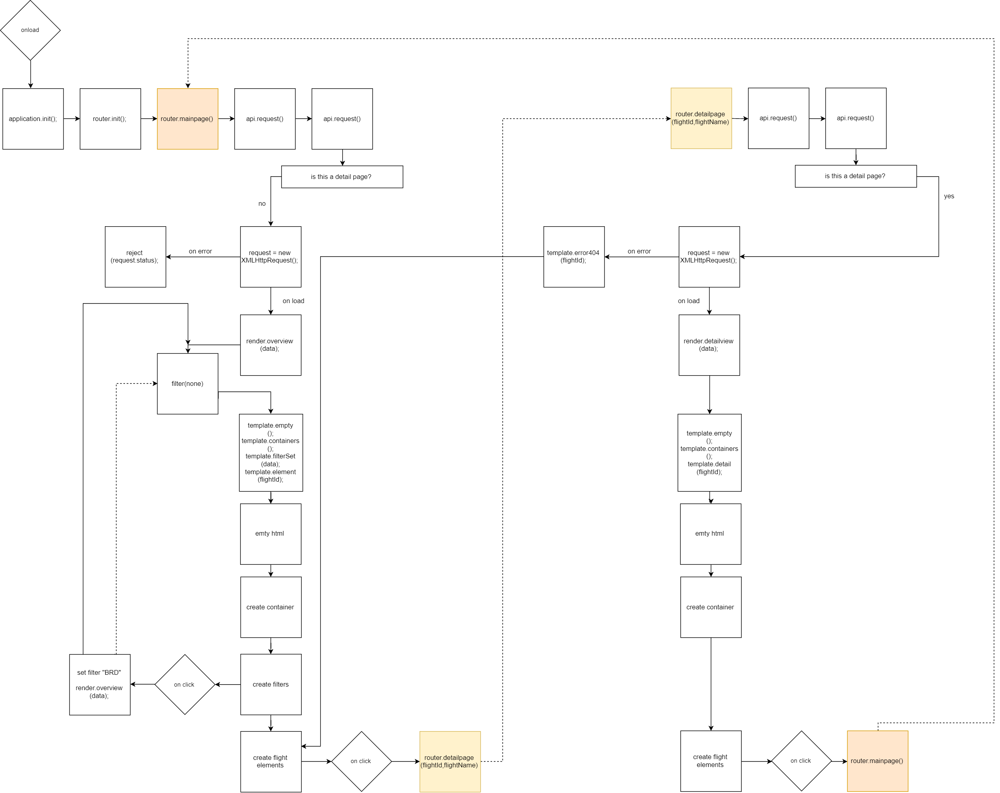

# Real Flight Info

Get your flight information from the most transparent and reliable source!
Its all you need!

Link: https://eager-euler-58eb64.netlify.com/

# Function

See the current flight from Schiphol with current flight status.

# Actor Diagram

# API
[-]	Schiphol Flight API

https://developer.schiphol.nl/

limited to 20 flights per page.

# Interaction

# Best practices
<s>[-] Used XMLHttpRequest; to get the flight information from the api.</s>

[-] Used promise to get the flight information from the api.

[-] Using 'Get date' I modified the request header to get the flight that are currently taking off.

[-] Using forEach I created a block for each departing flight.

[-] Used object literals to request and render different pages.

[-] added Router to detail pages of flights

# Feature Wishlist

## [📇] fix 404 flight not found when you click on a plane

## [💉] Nice UI

## [🎰] Filter options dropdown for different flight times and flight status
